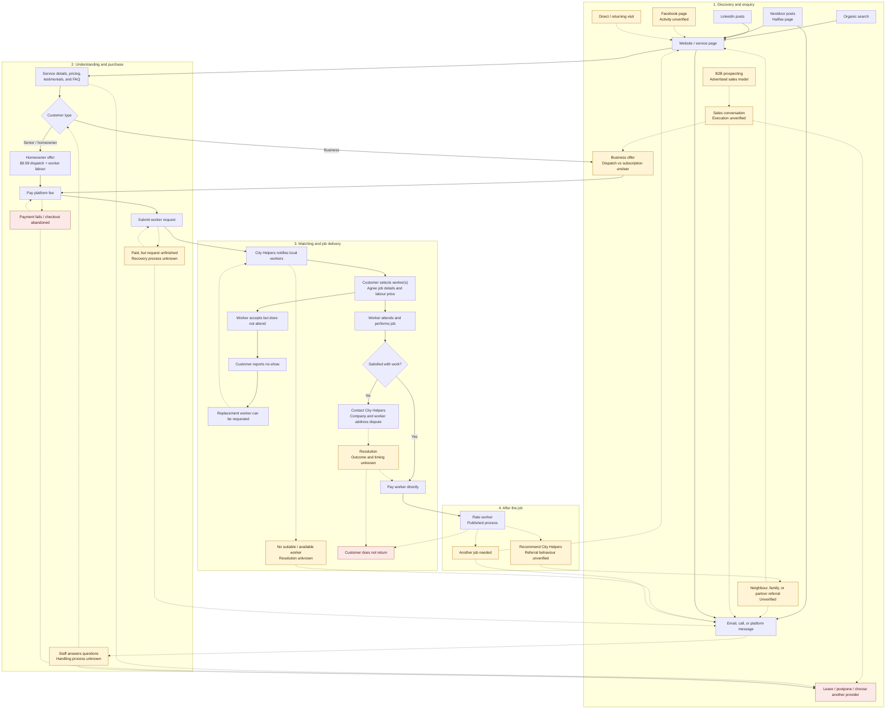

Solid arrows show published routes or the stated service process, not verified customer behaviour. Dashed arrows show possible paths whose operation is unverified. The map covers known entry points, booking, fulfilment, exceptions, and return visits; internal workflows remain unknown.

**Important unknowns:** actual checkout screens and account requirements; enquiry-to-booking handoffs; matching times; recovery after failed payment or unmatched requests; refund outcomes; repeat-customer fees; and automated reminders. The pricing page currently lists a business dispatch offer, while other pages still describe subscriptions. No paid-ad funnel or active outbound programme targeting seniors has been verified. Worker recruitment feeds service capacity and is outside this customer journey.

**Sources:** [Website](https://www.cityhelpers.ca/), [pricing](https://www.cityhelpers.ca/pricing-plans/plans-pricing), [published service process and exception policies](https://www.cityhelpers.ca/terms-and-conditions), [LinkedIn posts and sales recruitment](https://ca.linkedin.com/company/cityhelpers), [Nextdoor](https://ca.nextdoor.com/pages/city-helpers-inc/), and `EXISTING_MARKETING_FUNNEL.md`. Snapshot: 22 September 2026.
