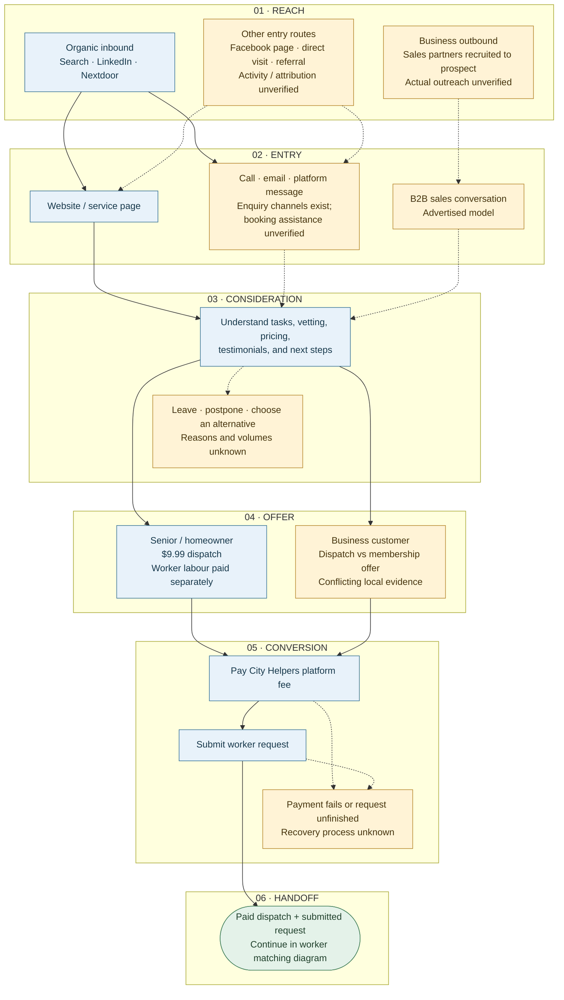

Read top to bottom. Each layer has one purpose; the branches show alternate customer routes. **Blue = documented channel or published process. Amber = activity or handling not verified.** Arrows describe the journey, not measured conversion. This map ends when a paid dispatch has a submitted worker request; operations continue in [worker matching and delivery](worker-matching.html).

**Scope:** seniors booking household help are the current priority; the existing business route is retained for completeness. Nextdoor evidence is from Halifax, not proof of Toronto reach. Facebook page presence does not establish an active campaign. Proposed ads, events, partnerships, and incentives remain in `ideas-and-work/`; they are not shown as existing acquisition channels.

**Handoff:** payment and request submission are separate milestones. A paid fee alone does not prove a request was submitted or a job completed. Customers may retry or return through the entry layer; recovery automation and repeat-booking fees are unknown. Matching, worker payment, complaints, and job outcomes belong exclusively to the operations diagram.

**Sources:** [existing marketing funnel](existing-marketing-funnel.html), [business context](context.html), [open questions](open-questions.html), and the CEO transcript `source-material/ceo-discussion-transcript.txt`. These document the advertised process; the full booking flow has not been tested. The funnel's pricing update conflicts with older subscription figures in `business-context.md`, so the business offer remains unresolved.
