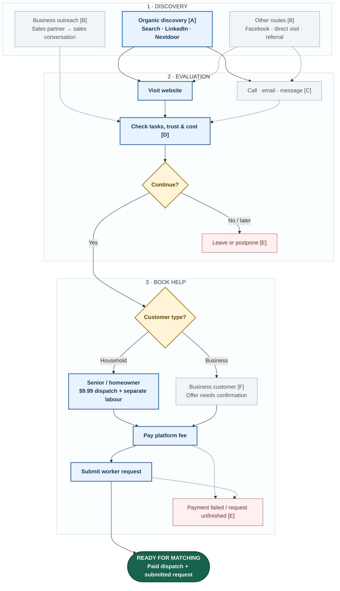

# Customer journey

**Discover → understand → book → hand off.** Follow the blue boxes for the main household route. Grey boxes show alternative routes; diamonds are choices; red boxes are incomplete outcomes; green marks the handoff. Dashed arrows indicate unverified activity or handling. Choices represent customer behaviour, not confirmed website screens.

### Details behind the map

| Key | Important detail |
| --- | --- |
| A · Organic discovery | Channels are documented; Nextdoor evidence is from Halifax, not proof of Toronto reach. |
| B · Other routes | Facebook presence does not prove active campaigns. Referral/direct attribution and actual sales-partner outreach are unverified. The B2B sales conversation is an advertised model. |
| C · Contact | Enquiry channels exist; staff-assisted booking is unverified. |
| D · Evaluation | Customers review task suitability, worker vetting, pricing, testimonials, and next steps. |
| E · Incomplete outcomes | Exit reasons, volumes, and recovery processes are unknown. Customers may retry or return through an entry route. |
| F · Business offer | Dispatch and membership descriptions conflict in local evidence. |

## Existing acquisition channels

Public-source snapshot, 22 September 2026. City Helpers markets in Halifax and Toronto; this project's priority is seniors booking for themselves in Toronto/GTA. These are visible channels and advertised processes; traffic, conversion, sales activity, and the full booking flow have not been verified. Proposed campaigns remain in Brainstorming.

| Inbound channel | Evidence and role | What remains unknown |
| --- | --- | --- |
| [LinkedIn](https://ca.linkedin.com/company/cityhelpers) | Regular household-help, business-labour, and worker-recruitment posts, usually linking to the website. | Customer reach, clicks, enquiries, and sales. |
| [Nextdoor](https://ca.nextdoor.com/pages/city-helpers-inc/) | Halifax business page with promotional posts, website/contact links, and a public service enquiry. | Toronto reach and whether enquiries become bookings. |
| [Facebook](https://www.facebook.com/profile.php?id=61563866975989) | Company page documented in the [introduction](business-context.md). | Posting activity, group participation, and campaign results. |
| [Website / organic search](https://www.cityhelpers.ca/) | Indexed service pages, testimonials, and customer calls to action. | Search rankings, organic traffic, and an active SEO programme. |

The website displays business partners, but their referral contribution is unverified. A project participant suggested finding customers through Facebook community groups; the CEO welcomed the idea. This does not establish an existing group-marketing programme.

**Outbound business sales:** a [LinkedIn recruitment post](https://ca.linkedin.com/company/cityhelpers) seeks commission-based sales partners to prospect, meet business owners, sell memberships, and maintain relationships, using company-generated opportunities and their own prospecting. This establishes recruitment for that model, not active representatives or sales results. Cold email, cold calling, direct messages, outreach volume, and follow-up processes remain unverified. No comparable outbound programme targeting seniors is established.

## Booking and return visits

The [published terms](https://www.cityhelpers.ca/terms-and-conditions) describe platform payment followed by a worker request. Payment and submission are separate milestones; neither proves a completed job. Email and messaging enquiry routes exist, but their handling and staff-assisted booking are unverified. Customers may leave, retry, or return; recovery processes, repeat-booking fees, reminders, referral incentives, and customer email campaigns remain unknown. Continue to [worker matching and delivery](worker-matching.md) for fulfilment, worker payment, ratings, and complaints.

**Pricing inconsistency:** the pricing-page snapshot recorded $9.99 dispatch offers for homeowners and businesses, while the [introduction](business-context.md) records earlier $99/month and $999/year business plans. Subscription language also appears elsewhere. Confirm the offer used at checkout and by sales representatives before treating either as settled. [Pricing page](https://www.cityhelpers.ca/pricing-plans/plans-pricing).

See [business objectives](business-objectives.md) for measurement gaps, [Q&A](open-questions.md) for pending questions, and the [CEO discussion transcript](https://devdogfish.github.io/cityhelpers/raw/source-material/ceo-discussion-transcript.txt) for the project discussion.
