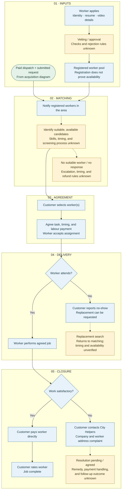

# Worker matching and delivery

Operational companion to [client acquisition](customer-journey.md). The shared boundary is **paid dispatch + submitted request**; this map contains no marketing channels, sales conversations, or checkout steps. Read top to bottom: inputs → matching → agreement → delivery → closure. **Blue = stated process. Amber = operational detail needing confirmation.** This is a business-process map, not evidence of implemented software or automated matching.

**What is established:** the local funnel records area notifications, customer selection, direct worker payment, ratings, replacement requests after no-shows, and support for complaints. The CEO described approximately 1,200 vetted Toronto registrations; this does not establish current coverage or available workers. The exact order of candidate responses, selection, and acceptance needs confirmation.

**What is not established:** an automatic matching algorithm, live availability checks, skill verification rules, response deadlines, or guaranteed fulfilment. The team proposed worker skill checkboxes and customer preferences; these remain improvements to investigate, not existing system capabilities. A replacement restarts matching; an unresolved case requires an operational decision, not an assumed refund or successful completion.

**Sources:** [existing marketing funnel](existing-marketing-funnel.md), [business context](business-context.md), [website and booking observations](../ideas-and-work/website-and-booking.md), [open questions](../looking-ahead/open-questions.md), and `ceo-discussion-transcript.txt`. These local notes reference the published service terms and team discussion; internal operations have not been observed.
