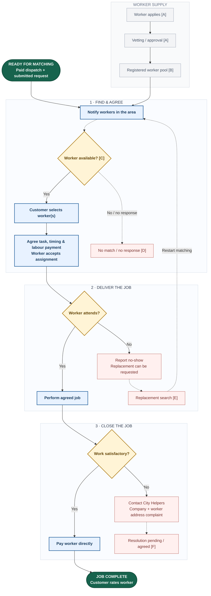

**Find a worker → agree the job → deliver → close.** Continue from the [customer journey](customer-journey.html). Blue boxes carry the main route; grey boxes supply workers; diamonds are decisions; red boxes show exceptions; green marks handoff or completion. Dashed arrows indicate handling needing confirmation. This maps the stated business process, not verified software or automation.

### Details behind the map

| Key | Important detail |
| --- | --- |
| A · Worker onboarding | Application includes identity, résumé, and video details. Vetting checks and rejection rules are unknown. |
| B · Worker pool | Registrations do not establish availability. The CEO described approximately 1,200 vetted Toronto registrations. |
| C · Candidate selection | Skills, timing, screening, and the order of responses, selection, and acceptance need confirmation. No automatic matching algorithm is established. |
| D · No match | Escalation, response deadlines, and refund rules are unknown. |
| E · Replacement | A replacement restarts matching; timing and availability are unverified. It does not guarantee fulfilment. |
| F · Complaint outcome | Remedy, payment handling, and follow-up are unknown. An unresolved case is not assumed to end in a refund or completed job. |

**What is established:** the [published service terms](https://www.cityhelpers.ca/terms-and-conditions) describe area notifications, customer selection, direct worker payment, ratings, replacement requests after no-shows, and support for complaints. The CEO described approximately 1,200 vetted Toronto registrations; this describes worker supply, not customer acquisition, current coverage, or active availability. The exact order of candidate responses, selection, and acceptance needs confirmation.

**What is not established:** an automatic matching algorithm, live availability checks, skill verification rules, response deadlines, or guaranteed fulfilment. The team proposed worker skill checkboxes and customer preferences; these remain improvements to investigate, not existing system capabilities. A replacement restarts matching; an unresolved case requires an operational decision, not an assumed refund or successful completion.

**Sources:** [customer journey](customer-journey.html), [business context](context.html), [website and booking observations](website-and-booking.html), [open questions](open-questions.html), and [CEO discussion transcript](https://devdogfish.github.io/cityhelpers/raw/source-material/ceo-discussion-transcript.txt). These notes reference the published service terms and team discussion; internal operations have not been observed.
